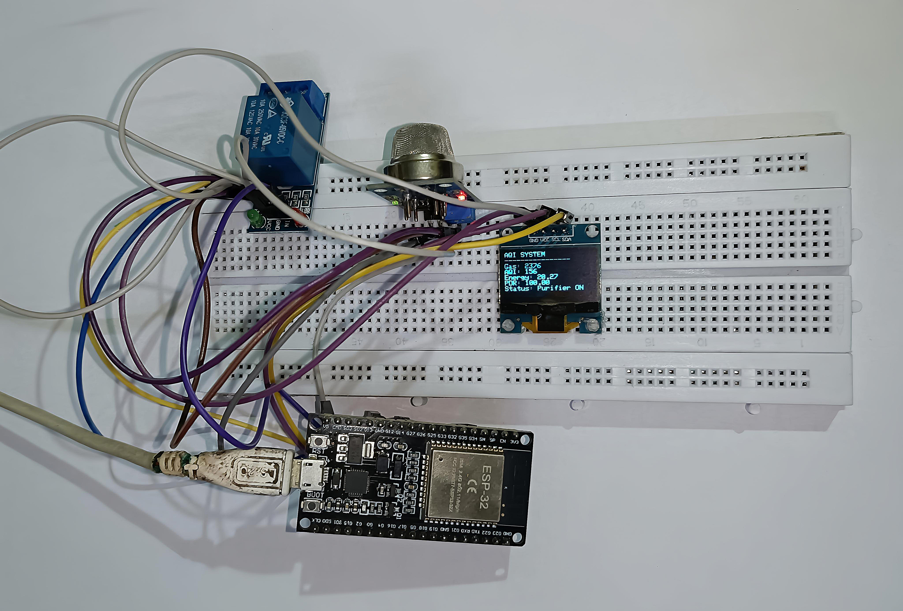
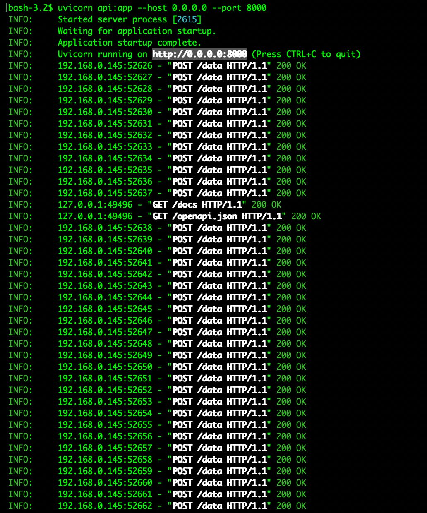
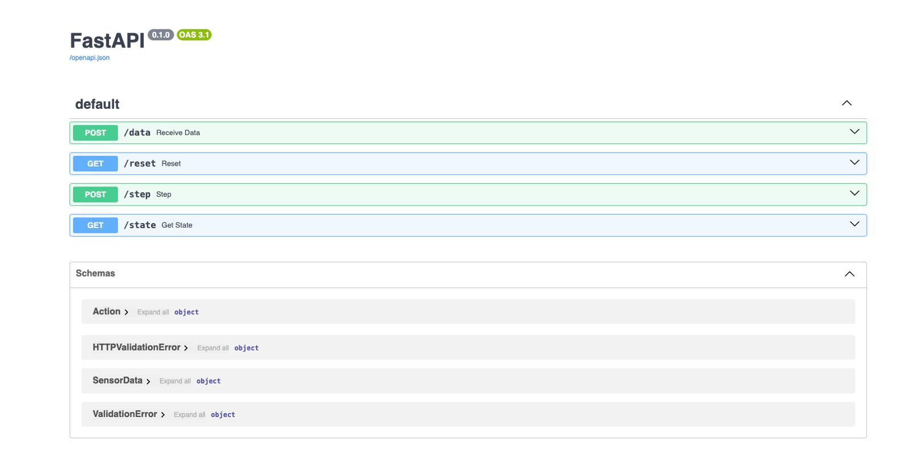
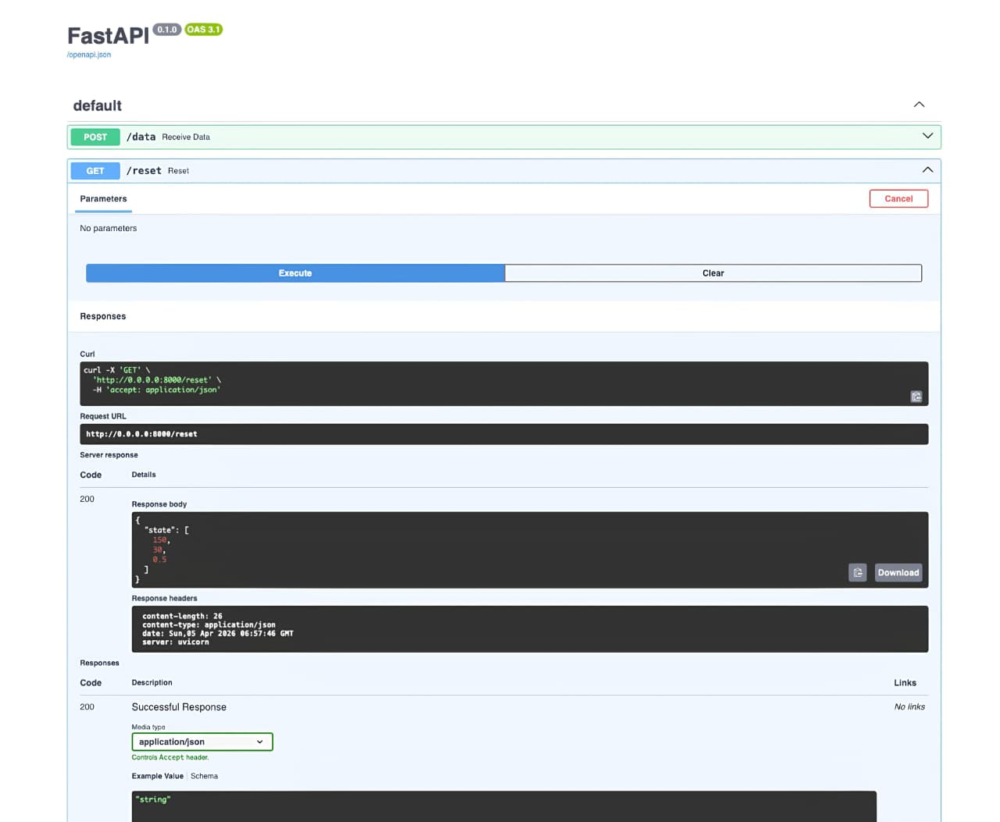
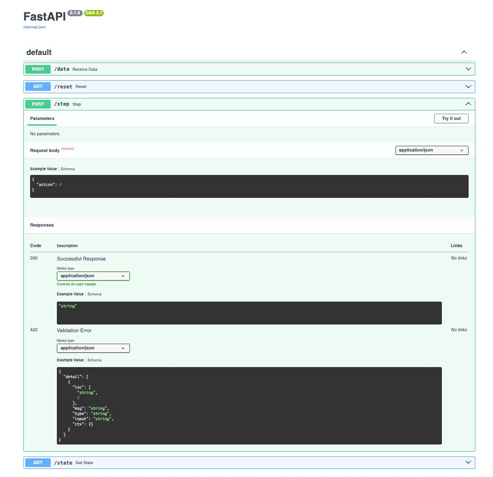
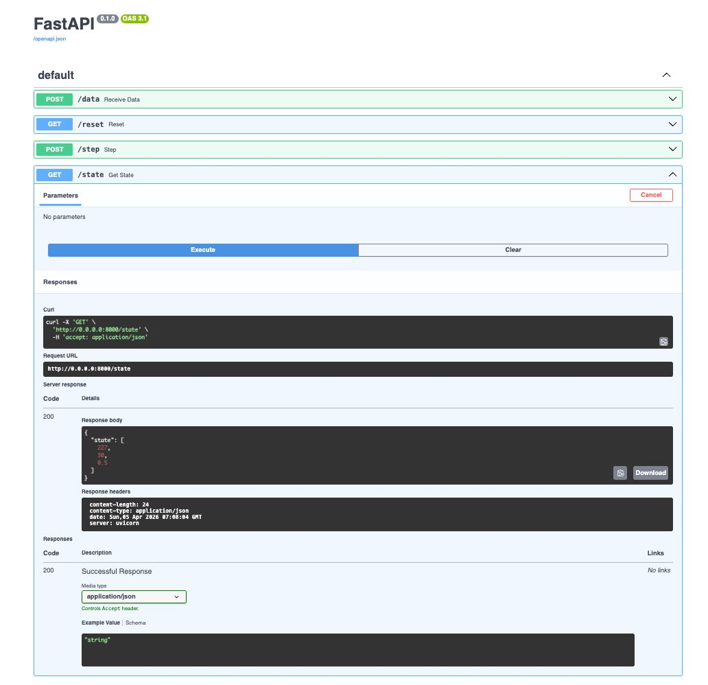

# 🌫️ AI-Based AQI Optimization & Monitoring System (OpenEnv + FastAPI)

A real-world reinforcement learning environment that simulates **Air Quality Index (AQI) optimization** using sensor data, FastAPI, and OpenEnv standards.

This system models how intelligent agents can **reduce pollution levels while minimizing energy consumption**, making it directly applicable to **smart cities, IoT systems, and environmental monitoring platforms**. 

---
## 🛠️ Hardware Setup Preview (Esp32MC, MQ135 Sensor, Relay Module, Oled Display):
<p align="center">
  
</p>


## 🚀 Overview

This project implements a **complete AI pipeline** for AQI monitoring:

* Sensor data ingestion via API
* Environment simulation (state transitions)
* Action-based AQI control
* Reward-driven optimization
* Agent evaluation via inference

### 🧠 Core Idea

The system simulates a real-world task:

> **Reducing air pollution using intelligent decision-making under constraints (energy + network reliability)**

---

## 🧩 Complete System Pipeline

```
Sensor → API (/data) → Environment State → Action → Reward → Agent → Evaluation
```

* Sensor sends gas data
* API converts it to AQI
* Agent chooses action (0,1,2)
* Environment updates state
* Reward computed based on AQI + energy
* Agent evaluated on performance

---

## 📁 Project Structure

```
.
├── api.py                 # FastAPI server (OpenEnv interface)
├── environment.py         # Local simulation environment
├── inference.py           # Baseline agent evaluation
├── openenv.yaml           # OpenEnv specification
├── requirements.txt       # Dependencies
├── Dockerfile             # Container setup
├── aqi_data.csv           # Logged sensor data
└── README.md
```

---

## ⚙️ Environment Description

### State Representation

```
state = [AQI, temperature, noise]
```

Example:

```
[150.0, 30.0, 0.5]
```

---

### Action Space

| Action | Description             |
| ------ | ----------------------- |
| 0      | Do nothing              |
| 1      | Moderate purification   |
| 2      | Aggressive purification |

---

### Observation Space

* AQI (Air Quality Index)
* Temperature
* Noise level

---

## 🧪 OpenEnv Specification

This project fully complies with OpenEnv:

### Required Methods

* `reset()` → initialize environment
* `step(action)` → apply action and return transition
* `state()` → retrieve current state

---

### Step Function

Returns:

```
(observation, reward, done, info)
```

---

### openenv.yaml

```yaml
name: aqi-optimization-env
version: 0.1.0
description: Reinforcement learning environment for AQI reduction
observation_space: [aqi, temperature, noise]
action_space: [0, 1, 2]
reward: minimize AQI and energy usage
termination: AQI < 50
```

---

## 📡 API (FastAPI Backend)

The environment is exposed via REST APIs:

| Method | Endpoint | Description         |
| ------ | -------- | ------------------- |
| POST   | /data    | Receive sensor data |
| GET    | /reset   | Reset environment   |
| POST   | /step    | Execute action      |
| GET    | /state   | Get current state   |

---
## 🔹Starting the server uvicorn:
<p align="center">
  
</p>

## 🔹FASTAPI_UI:
<p align="center">
  
</p>

## 🔹Reset():
<p align="center">
  
</p>

## 🔹Step():
<p align="center">
  
</p>

## 🔹Get State():
<p align="center">
  
</p>


## 🔁 Environment Logic

### AQI Control

* Action 1 → AQI −10
* Action 2 → AQI −20

---

### Reward Function

The reward is **dense and continuous**:

#### Positive Signals

* Lower AQI → higher reward
* Efficient energy usage
* Faster convergence

#### Penalties

* High AQI
* Excessive energy use
* Unnecessary actions

---

### Termination Condition

```
AQI < 50 → done = True
```

---

## 🎯 Tasks & Evaluation

Three graded tasks simulate increasing difficulty:

---

### 🟢 Easy Task

* Target AQI: 100
* Simple reduction
* Minimal steps required

---

### 🟡 Medium Task

* Target AQI: 70
* Requires efficient action planning
* Balance energy vs reduction

---

### 🔴 Hard Task

* Target AQI: 50
* Requires optimal strategy
* Penalizes inefficiency heavily

---

### 📊 Grading System

Score ∈ [0.0 – 1.0]

* Based on distance to target AQI
* Penalizes energy usage
* Rewards efficiency

---

## 🤖 Baseline Inference (Agent)

The baseline agent uses a simple heuristic:

```python
if current_aqi > target:
    action = 2
else:
    action = 0
```

---

### Run Inference

```bash
python inference.py
```

---

### Example Scores

| Task   | Score |
| ------ | ----- |
| Easy   | 0.90  |
| Medium | 0.75  |
| Hard   | 0.60  |

---

## 🛠️ Requirements

* Python 3.8+
* FastAPI
* Uvicorn
* NumPy
* Requests
* Docker

---

## 📦 Installation

```bash
python -m venv .venv
source .venv/bin/activate
pip install -r requirements.txt
```

---

## ▶️ Running Locally

```bash
uvicorn api:app --host 0.0.0.0 --port 8000
```

Open:

```
http://localhost:8000/docs
```

---

## 🐳 Docker Setup

### Build

```bash
docker build -t aqi-openenv .
```

### Run

```bash
docker run -p 8000:8000 aqi-openenv
```

---

## ☁️ Hugging Face Spaces Deployment

* Runtime: Docker
* Tag: `openenv`
* Port: `7860` or `8000`

Ensure:

* Dockerfile present
* API starts automatically
* Environment accessible

---

## 📈 Metrics Tracked

* AQI levels
* Energy consumption
* Packet Delivery Ratio (PDR)

Example:

```
PDR = successful_tx / total_tx
```

---

## 🗃️ Data Logging

All events are stored in:

```
aqi_data.csv
```

Includes:

* timestamp
* gas value
* AQI
* action taken
* PDR
* energy

---

## ✅ Validation

```bash
openenv validate .
```

---

## 🔮 Future Improvements

* Real IoT sensor integration
* Advanced RL agents (PPO, DQN)
* Multi-agent coordination
* Weather-aware AQI modeling

---

## 📜 License

MIT License

---

## 🤝 Contribution

PRs and improvements are welcome.

---

## 📬 Contact

For questions or collaboration, open an issue or discussion.
